# Lv.3 NLP-10 (Fin-GPT) : 뇌뺴고 경제 뉴스 읽기 프로젝트
  
본 프로젝트는 네이버커넥츠재단 부스트캠프 AI Tech 6기의 최종 프로젝트입니다.  
개발 방법과 실제 시연 영상 올려두었으니 ReadMe 모두 확인 바랍니다.  
2달이 안되는 sprint 개발에 성실히 참여한 우리 Fin-GPT 팀 다시 한 번 수고 많으셨습니다.

</div>


# 1. 프로젝트 개요 
## 1.1. 프로젝트 소개
### 기획 배경
저희는 하루에 3000건 이상 쏟아지는 경제 뉴스가 쏟아져 나오고 있었고 이를 모두 소화하기에는 실질적으로 어려움이 따른다고 생각했습니다.   
또한, 여러 언론사들이 같은 내용의 뉴스들을 작성하는 경우가 빈번하여 읽은 뉴스를 또 보게 되는 피로감이 쌓입니다.  
이에 “편하고 효율적으로 경제 뉴스를 소비할 수 있는 서비스를 만들어보면 어떨까?” 라는 아이디어를 가지고 프로젝트를 기획하게 되었습니다.

### 프로젝트 주제 및 주요 서비스
<div align='center'>
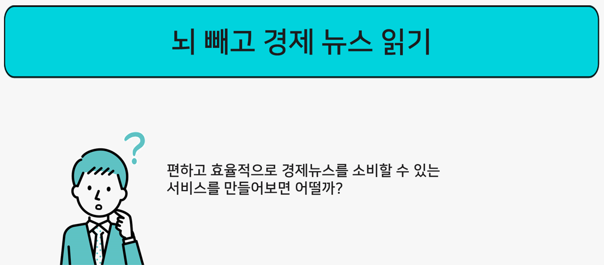</img>
</div>

 `뇌빼고 경제 뉴스` 프로젝트는 온라인 경제 뉴스 기사를 모아 중요한 내용을 쉽고 빠르게 파악할 수 있도록 하는 프로젝트 입니다.   
 저희 프로젝트는 아래와 같은 서비스를 제공합니다.     
 
✅중복되는 내용의 여러 뉴스들을 모아 **기간별/기업별로 주요 토픽과 뉴스 요약문을 제공**합니다.    
✅뉴스의 긍부정 정보와 주가 현황 등 **기업별로 정리된 금융 정보를 제공**합니다.  
✅여러 경제 지표와 기업별 주요 토픽을 정리한 **일일 리포트를 제공**합니다.  


## 1.2. Fin-GPT 팀 소개 및 역할
<div align='center'>

|권예진 [](https://github.com/Becky-Kwon)|문지원 [](https://github.com/jwmooon)|방제형 [](https://github.com/BJH9)|이경재 [](https://github.com/EbanLee)|이종원 [](https://github.com/jongwoncode)|
|:-:|:-:|:-:|:-:|:-:|
|</img>|</img>|</img>|</img>|</img>|
|DB ERP 설계<br>DB 구축 및 관리<br>데이터 수집<br>웹 페이지 디자인<br>백엔드 API 개발<br>발표 자료 제작|프론트엔드 개발<br>API 연동<br>감성분석 모델 학습<br>웹 페이지 디자인|DB ERP 설계<br>DB 구축 및 관리<br>백엔드API 개발<br>프론트엔드 개발<br>API 연동|EC2 서버 구축<br>학습데이터조사<br>요약모델 학습 및 개선<br>요약문 임베딩<br>클러스터링<br>토픽생성 기획 및 구현|PM<br>DB ERP 설계<br>Data Pipeline 구축<br>자동화 과정 설계<br>요약 모델 학습|

</div>

## 1.3. 프로젝트 구조도

<div align='center'>

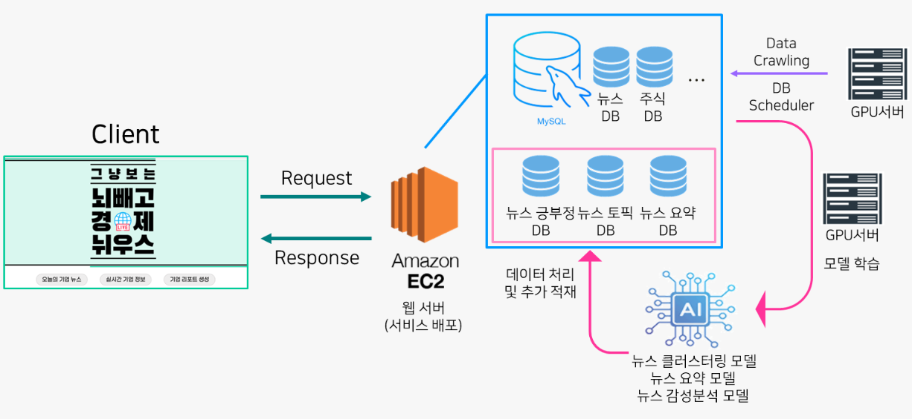</img>

</div>

## 1.4. 개발/협업 환경

### 하드웨어
> **Tesla V100 32GB** * 2EA <br> **AWS EC2 사양 모름** * 1EA

### 소프트웨어 및 라이브러리
```


보안 필요
pandas==1.1.5
scikit-learn~=0.24.1
transformers==4.10.0
torch==1.10.0
```

### GitHub
현업에서 진행하는 방식을 최대한 따르려고 노력했습니다. 이슈와 PR 템플릿을 작성하고, 팀 내의 커밋 컨벤션 규칙을 작성하여 후에 봐도 통일된 모습으로 쉽게 변경 사항을 찾을 수 있도록 했습니다. 기본 템플릿을 main 브랜치로 둔 뒤에, dev 브랜치에서 개발을 진행하였습니다. dev 브랜치에서도 새로운 기능을 개발할 때는 새로운 브랜치로 분기를 만들어 진행한 뒤 작성이 끝나면 dev 브랜치로 Pull Request를 작성하고, 팀원의 리뷰를 받은 뒤 병합을 진행하였습니다.

### Notion
메인 Task 보드를 두고, 그곳에 자신의 업무 페이지를 작성하여 담당자를 할당한 후, 태그를 준비/진행 중/완료로 나누어 진행 상황을 공유했습니다. 해당 페이지에는 본인의 작업 기간을 표시하여 타임라인으로도 활용했습니다.
그리고 정보와 자료의 공유 공간으로 사용했습니다. 자신은 익숙하지만, 팀원들은 모를 수 있는 팁을 직접 작성하기도 하고, 팀원들이 읽어봤으면 하는 레퍼런스를 공유했습니다.

### 프로젝트 템플릿
주어진 Baseline 코드는 모델, 데이터로더, 학습까지 하나의 파일에 전부 작성되어 있었습니다. 앞으로 진행할 다른 대회에도 사용할 수 있도록 프로젝트 템플릿을 작성하여 그에 맞게 모듈화하여 구획하였습니다. 디렉토리는 원활한 실험을 위한 설정 파일을 담은 config, 학습, 검증, 평가, 증강 데이터를 담은 data, 학습이 끝난 모델과 inference 결과를 저장하는 output, 학습된 모델의 파라미터를 저장하는 checkpoint, Jupyter Notebook 작업을 수행하는 notebook, 데이터 전처리와 증강 등 다양한 곳에 사용한 모듈을 저장하는 utils으로 구분했습니다. 

```
📦 level2-3-nlp-finalproject-nlp-10
├─ .github
│  └─ .keep
├─ .gitignore
├─ README.md
├─ backend
│  └─ src
│     ├─ __pycache__
│     │  └─ main.cpython-311.pyc
│     ├─ api
│     │  ├─ __init__.py
│     │  ├─ __pycache__
│     │  │  ├─ company_api.cpython-311.pyc
│     │  │  ├─ news_api.cpython-311.pyc
│     │  │  └─ topic_api.cpython-311.pyc
│     │  ├─ api.py
│     │  ├─ company_api.py
│     │  ├─ news_api.py
│     │  └─ topic_api.py
│     ├─ database
│     │  ├─ __init__.py
│     │  ├─ __pycache__
│     │  │  ├─ connection.cpython-311.pyc
│     │  │  └─ orm.cpython-311.pyc
│     │  ├─ connection.py
│     │  └─ orm.py
│     ├─ main.py
│     ├─ must_read.txt
│     ├─ repository
│     │  ├─ company_repository.py
│     │  ├─ news_repository.py
│     │  ├─ repository.py
│     │  └─ topic_repository.py
│     ├─ schema
│     │  ├─ __init__.py
│     │  ├─ dto.py
│     │  ├─ request.py
│     │  └─ response.py
│     └─ service
│        ├─ company_service.py
│        ├─ news_service.py
│        ├─ service.py
│        └─ topic_service.py
├─ data
│  ├─ crawling.py
│  ├─ engine.py
│  ├─ engine_macro.py
│  ├─ log
│  │  └─ log.txt
│  ├─ preprocessing.py
│  └─ utils
│     ├─ company.csv
│     └─ krxlist.csv
├─ frontend
│  ├─ .gitignore
│  ├─ README.md
│  ├─ package-lock.json
│  ├─ package.json
│  ├─ public
│  │  ├─ favicon.ico
│  │  ├─ index.html
│  │  ├─ logo192.png
│  │  ├─ logo512.png
│  │  ├─ manifest.json
│  │  └─ robots.txt
│  └─ src
│     ├─ App.js
│     ├─ Router.js
│     ├─ api
│     │  └─ AllnewsApi.js
│     ├─ components
│     │  ├─ App.css
│     │  ├─ Bu.js
│     │  ├─ Bub.js
│     │  ├─ Bubble.js
│     │  ├─ CompanyRecentNews.js
│     │  ├─ Example.js
│     │  ├─ FilterTab.js
│     │  ├─ KeywordChart.js
│     │  ├─ NavBar.js
│     │  ├─ NewsDetail.js
│     │  ├─ ReportCompanyTopic.js
│     │  ├─ ReportEconomyInfo.js
│     │  ├─ SentimentInfo.js
│     │  ├─ StockInfo.js
│     │  ├─ TopNews.js
│     │  ├─ c.js
│     │  └─ sq.js
│     ├─ css
│     │  ├─ font.css
│     │  ├─ layout.css
│     │  └─ style.css
│     ├─ img
│     │  ├─ diagram.png
│     │  ├─ liveLogo.png
│     │  ├─ samsung.png
│     │  └─ titleBackground.png
│     ├─ index.js
│     └─ pages
│        ├─ Allnews.js
│        ├─ CompanyInfo.js
│        ├─ Companynews.js
│        ├─ Contents.js
│        ├─ Main.js
│        └─ Report.js
├─ img
├─ model
│  ├─ clustering
│  │  ├─ code
│  │  │  ├─ dense_clustering.py
│  │  │  ├─ sparse_clustering.ipynb
│  │  │  ├─ sparse_clustering.py
│  │  │  └─ test.py
│  │  └─ read_me.txt
│  ├─ embedding
│  │  ├─ code
│  │  │  ├─ embed.py
│  │  │  └─ test.py
│  │  └─ read_me.txt
│  ├─ sentiment_analysis
│  │  └─ code
│  │     ├─ sentiment_prediction.py
│  │     └─ sentiment_train.py
│  ├─ subject
│  │  ├─ code
│  │  │  ├─ data_load.py
│  │  │  ├─ make_dataset.py
│  │  │  ├─ prepocess.py
│  │  │  ├─ test.py
│  │  │  ├─ train.py
│  │  │  └─ vaildation.py
│  │  └─ read_me.txt
│  └─ summary
│     └─ code
│        ├─ data_load.py
│        ├─ make_dataset.py
│        ├─ make_summary_dataframe.py
│        ├─ preprocess.py
│        ├─ summary.py
│        ├─ test.py
│        └─ training.py
└─ requirements.txt
```
©generated by [Project Tree Generator](https://woochanleee.github.io/project-tree-generator)


## 1.5. 프로젝트 로드맵

<div align='center'>

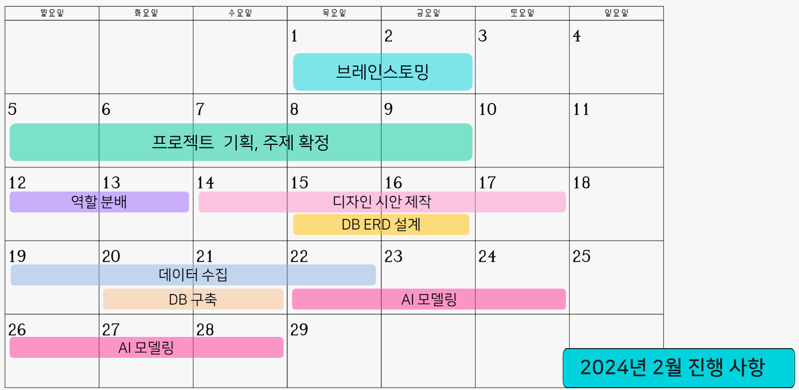</img>
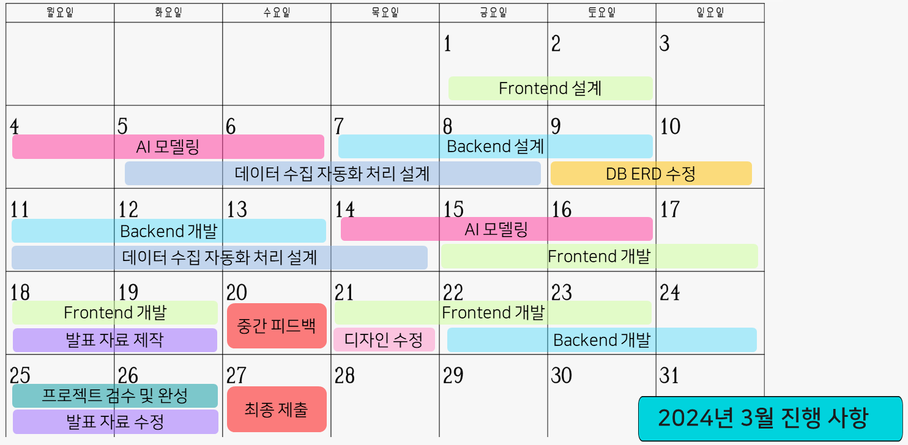</img>

</div>

<br>

# 2. 데이터 수집 및 관리
## 2.1. 데이터 수집
네이버 경제 뉴스 사이트에서 뉴스 데이터를 crawling을 통해 수집하였고, 이외 주가 및 주요 경제 지표 값은 yfinance, FinanceDataReader, pykrx 라이브러리를 사용해 수집했습니다.

### ✅ 경제 뉴스 수집 출처
- 네이버 뉴스의 경제 파트
- 네이버 증권 뉴스의 주요뉴스
- 네이버 증권 뉴스의 뉴스포커스 시황/전망
- 네이버 증권 뉴스의 뉴스포커스 기업/종목분석
- 네이버 증권 뉴스의 뉴스포커스 공시/메모 정보
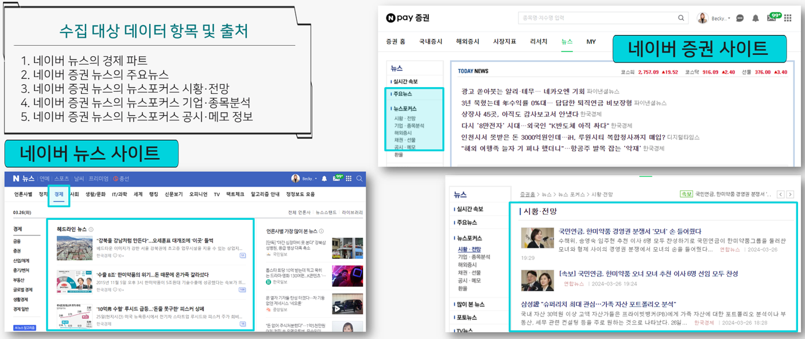</img>
<br>


## 2.2. DB 구축 및 DB 스키마
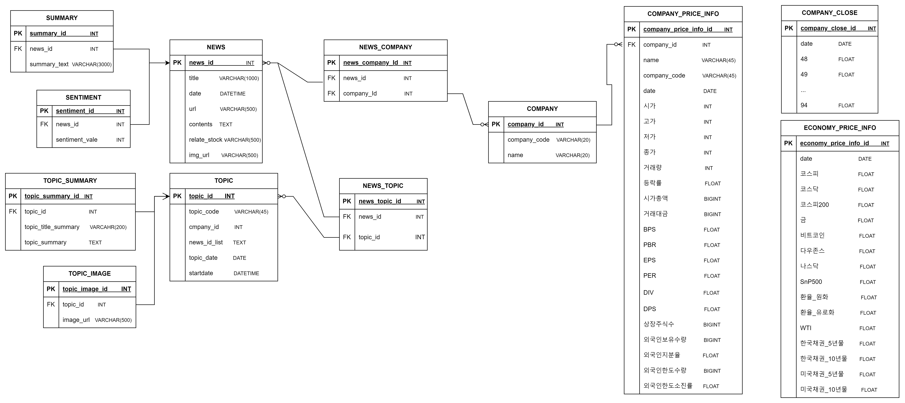</img>
DB는 EC2 서버 내에 MySQL을 설치하고 관리하였고, DB ERD 설계시 총 12개의 테이블을 생성했습니다.   
ERD 설계 과정에서 DB 정규화를 통해 데이터 구조의 안정성과 무결성을 확보했습니다.   
<br>

## 2.3. DB 자동화 수집 방법론
하나의 GPU 서버에서는 crontab 스케쥴러를 통해 4시간 단위로 데이터를 수집 및 DB 적재 자동화를 수행합니다. 그리고 다른 GPU 서버에서는 모델 학습 및 성능 개선을 수행하고 있습니다.  
자동화 과정은 아래와 같이 이뤄지고 있어, 실시간 뉴스를 4시간 마다 수집하고 가공해 서비스하고 있습니다.

</img>
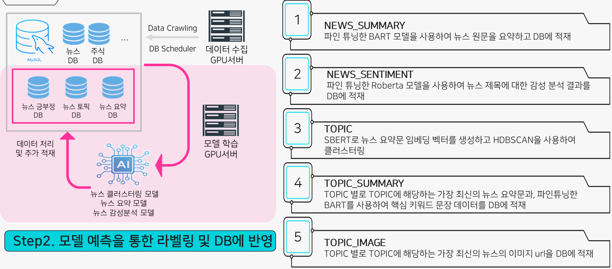</img>
<br>
<br>


# 3. AI 모델링
## 3.1. 데이터 기본 전처리
뉴스 텍스트에 전반적으로 적용한 전처리 방법입니다. 특히 요약 모델과 핵심 제목 추출 모델의 학습과 출력에 적용하였습니다.

<div align='center'>
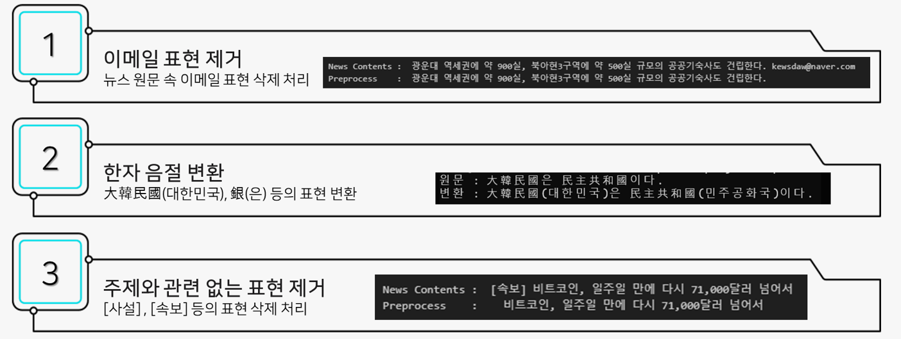</img>
</div>

## 3.2. 뉴스 내용 요약 모델
<div align='center'>
</img>
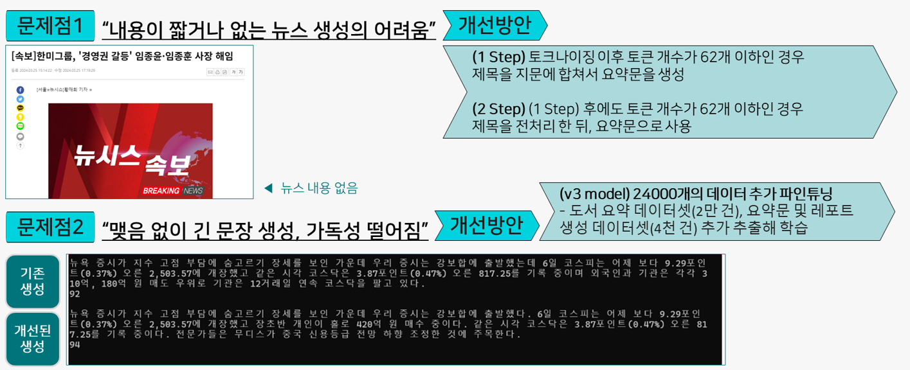</img>
</div>


## 3.3. 뉴스 핵심 제목 추출 모델
<div align='center'>
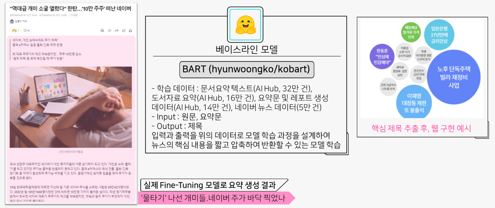</img>
</div>


## 3.4. 뉴스 클러스터링
<div align='center'>
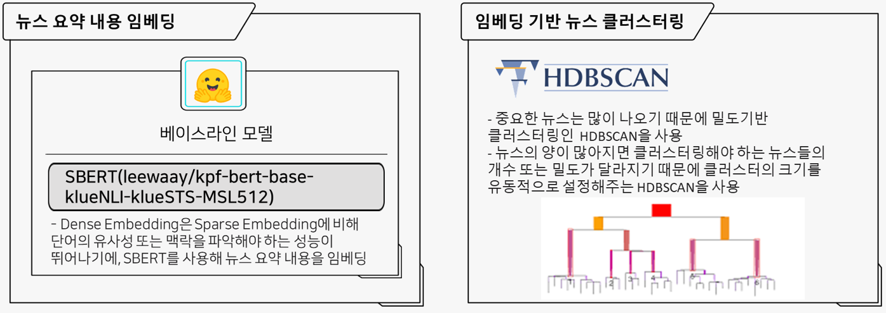</img>
</div>


## 3.5 뉴스 감성 분석 모델
<div align='center'>
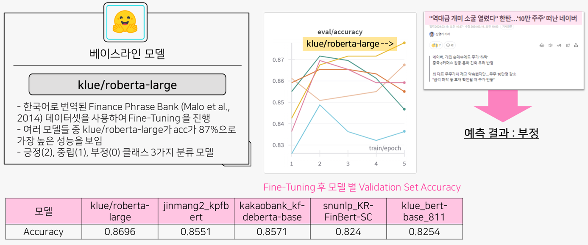</img>
</div>


# 4. 프로젝트 구현
## 4.1. 개발 프레임워크

## 4.2 최종 시연 영상


